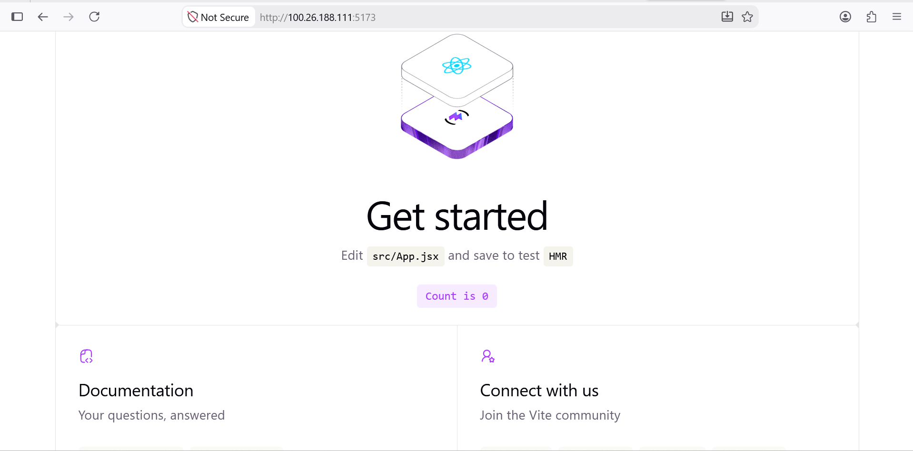
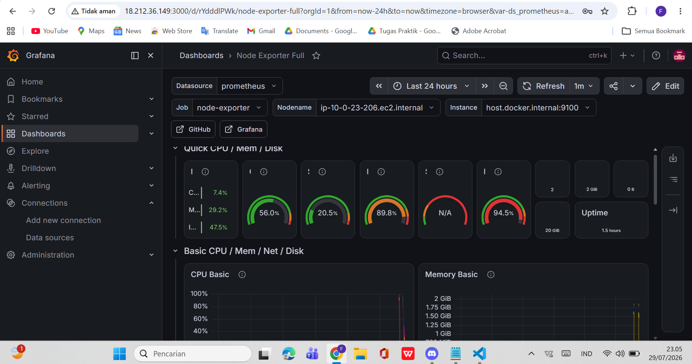
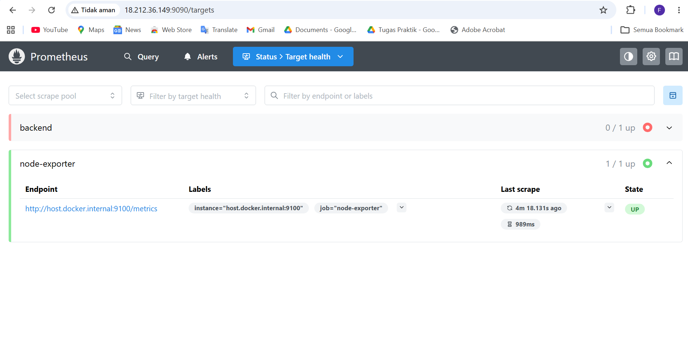
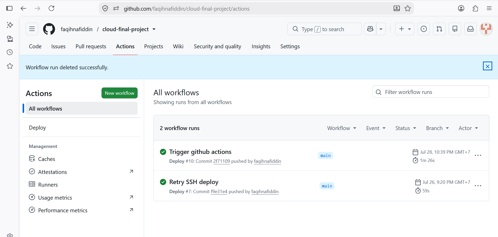

# Cloud Full Stack Deployment Project

This project demonstrates deployment of a full-stack web application on AWS using Docker, GitHub Actions, Prometheus, and Grafana.
The application consists of:
- React Frontend
- Express Backend
- MongoDB Database
- Monitoring with Prometheus & Grafana
- CI/CD using GitHub Actions

## Project Description

This application is a simple full-stack web application.

Users access the React frontend.

The frontend communicates with the Express REST API.

The backend stores data inside MongoDB.

The application is deployed on AWS EC2 using Docker Compose.

Continuous Deployment is handled by GitHub Actions.

## Application Architecture

           User
             v
      React Frontend
             v
      Express Backend
             v
         MongoDB

Monitoring
Node Exporter
      v
 Prometheus
      v
  Grafana

## Technologies Used

- React
- Vite
- Express.js
- MongoDB
- Docker
- Docker Compose
- GitHub Actions
- AWS EC2
- Prometheus
- Grafana
- Node Exporter

## Run Locally

Clone repository
bash
git clone https://github.com/USERNAME/cloud-final-project.git

Masuk folder
bash
cd cloud-final-project

Build Docker
bash
docker compose build

Jalankan
bash
docker compose up -d

Akses aplikasi

Frontend
http://localhost:5173

Backend
http://localhost:5000

Grafana
http://localhost:3000

Prometheus
http://localhost:9090

## Cloud Deployment

1. Launch AWS EC2
2. Install Docker
3. Install Docker Compose
4. Clone repository
5. Configure GitHub Secrets
6. Push code to GitHub
7. GitHub Actions automatically builds Docker images
8. GitHub Actions connects to EC2
9. Docker Compose pulls latest images
10. Containers restart automatically

## Monitoring

Monitoring uses:

- Prometheus
- Grafana
- Node Exporter

Metrics collected include:

- CPU Usage
- Memory Usage
- Disk Usage
- Network Traffic

Grafana Dashboard:
Node Exporter Full (ID 1860)

## Project Structure

cloud-final-project/
│
├── backend/
├── frontend/
├── monitoring/
│   └── prometheus.yml
├── .github/
│   └── workflows/
│       └── deploy.yml
├── docker-compose.yml
└── README.md

screenshots/

## Live Demo

Application
(http://18.212.36.149/)

Backend API
http://18.212.36.149:5000

Grafana
http://18.212.36.149:3000

Prometheus
http://18.212.36.149:9090

